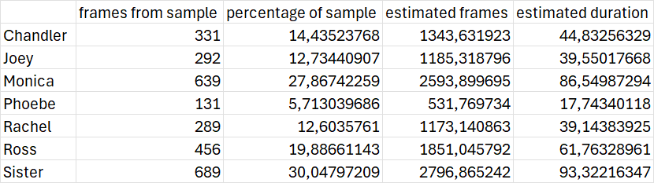

This set of pictures is made with MediaPipe facedetection.

The setting used were:

- min_detection_confidence=0.1,  
this was set low because we wanted as many pictures of faces, false positives were later manually removed. 

- model=1, 
this is the long range model of MediaPipe.

- sample_chance=25 
on average every 4th frame was searched for faces.

Total frames of Friends.mp4: 9308 \
Sampled frames: 2293 \
Nr frames per second: 29.97 \
1 frame takes 0,0333667 seconds 

	frames from sample	percentage of sample	estimated frames	estimated duration
Chandler	331	14,43523768	1343,631923	44,83256329
Joey	292	12,73440907	1185,318796	39,55017668
Monica	639	27,86742259	2593,899695	86,54987294
Phoebe	131	5,713039686	531,769734	17,74340118
Rachel	289	12,6035761	1173,140863	39,14383925
Ross	456	19,88661143	1851,045792	61,76328961
Sister	687	30,04797209	2796,865242	93,32216347

Counter({'Rachel': 289, 'Chandler': 331, 'Monica': 639, 'Joey': 292, 'Phoebe': 131, 'Ross': 456, 'Unknown': 687})